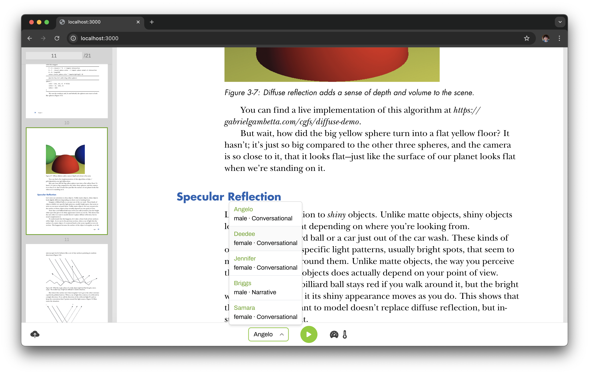

## About



Interact with a PDF using [play.ai](https://play.ai/)'s audio features.

## Features

- [x] PDF file upload
    - [x] Parsed and displayed on a per-page basis
    - [x] Navigate between pages
- [X] Audio playback for current page
    - [x] TTS with [play.ai](https://play.ai/)'s TTS API, controls (play/pause) for audio playback
    - [x] Dropdown for selecting voice
    - [x] Progress indicator for generating audio for pages
    - [x] Adjust speed and temp of audio input.
- [ ] [play.ai]()'s Agent API to interact with agent on PDF content
- [ ] Responsive UI

* Arrows for back/forward, space for play/pause

## Install/Usage

Clone this repo.

Fill `.env.local`:

```
PLAY_API_KEY=
PLAY_USER_ID=
```

Run `yarn i && yarn run dev`, or with your package manager of choice.

## Behind-the-scenes

Next.js, TypeScript, and Tailwind.